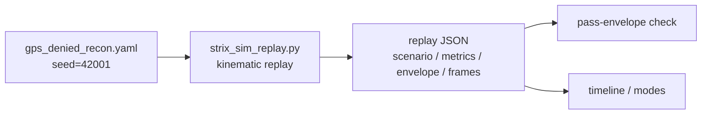

# STRIX Reviewer Demo — `gps_denied_recon` (Software Replay)

> Simulation-only. Zero hardware flights. No RF/sensor fidelity. No field validation. Safety claims are limited to classical-CBF + ROE + traces + simulator; no trained-neural safety guarantee is claimed.

This is a **static, reviewer-facing** walkthrough of one deterministic software-only
scenario replay. It shows exactly how to reproduce a single worked scenario and what
the harness emits, so a reviewer can re-run it and obtain byte-identical output.

- **Scope:** documentation-only. No source, manifest, or test was modified to produce this doc.
- **Evidence kind:** `software_replay`, `fidelity = deterministic_kinematic_public_replay`.
- **As-of commit:** `3a5d46de4ed69f4321c058ae55d84047e2ccad49` (`main`, working tree clean).
- **Claim posture:** every figure below is a *prior measured software-replay result to be
  re-run on the exact submission commit*, never a final live fact, and never inferred
  hardware/RF/field readiness. See [`../CAPABILITY_BOUNDARY.md`](../CAPABILITY_BOUNDARY.md).

The replay harness is a lightweight **kinematic** scenario player. It is **not** a
field-physics, RF, or hardware-fidelity simulator. Its purpose is repeatable,
inspectable public scenario behavior before any integration testing.

---

## 1. The worked scenario

`gps_denied_recon` — four aerial agents fly a reconnaissance pattern and transition to
GPS-denied (degraded) navigation when GPS is lost at `t = 30 s`. The scenario's seed is
fixed at **42001** inside the scenario file itself
(`sim/scenarios/gps_denied_recon.yaml`), so the replay is deterministic by construction.

```
Scenario:  gps_denied_recon
Seed:      42001            (defined in the scenario YAML; the harness reads it)
Duration:  600 s           Tick: 10 s            Frames: 61            Agents: 4
```

---

## 2. Exact replay command

The harness takes the scenario file as input and reads `seed: 42001` from it (there is no
`--seed` flag — the seed is a scenario property). Run from the repository root:

```bash
python3 scripts/strix_sim_replay.py \
  --scenario sim/scenarios/gps_denied_recon.yaml \
  --output /tmp/a1_run.json \
  --no-html
```

`--no-html` writes only the JSON evidence. The process exits `0` when the scenario's
pass-envelope is satisfied.

---

## 3. Determinism proof (double run, byte-identical)

The command was run **twice** in sequence into two separate files, then compared byte-for-byte:

```bash
python3 scripts/strix_sim_replay.py --scenario sim/scenarios/gps_denied_recon.yaml --output /tmp/a1_run1.json --no-html
python3 scripts/strix_sim_replay.py --scenario sim/scenarios/gps_denied_recon.yaml --output /tmp/a1_run2.json --no-html
cmp -s /tmp/a1_run1.json /tmp/a1_run2.json && echo "byte-identical"
```

Within a single checkout, the two runs are **byte-for-byte identical to each other** —
`cmp -s` reports no difference.

> The whole-file `sha256sum` is **intentionally not pinned** in this doc. The replay
> JSON embeds a `repo` block (`commit`, `branch`, `working_tree_clean`) that reflects
> *your* git context, not the simulation, so the same seeded run yields a *different*
> whole-file hash per checkout — any concrete value here would be a checkout-specific
> reviewer trap.
>
> What **does** reproduce deterministically on any checkout is the seed-driven
> simulation content — the `scenario`, `metrics`, and `envelope` blocks (Section 4).
> Verify reproducibility by comparing **those blocks**, not a whole-file SHA.

---

## 4. Captured output excerpt

A captured excerpt of the harness output for this run is stored alongside this doc at
[`replay_output.txt`](replay_output.txt). The load-bearing parts are reproduced below.

### 4.1 Scenario header — `replay["scenario"]`

```json
{
  "config_hash": "829cc17c46b98d72",
  "duration_s": 600.0,
  "id": "gps_denied_recon",
  "name": "GPS-Denied Reconnaissance",
  "path": "sim/scenarios/gps_denied_recon.yaml",
  "seed": 42001,
  "tick_s": 10.0
}
```

### 4.2 Metrics — `replay["metrics"]`

```json
{
  "active_agents": 4,
  "area_coverage_pct": 100.0,
  "formation_coherence": 0.78,
  "frame_count": 61,
  "mean_energy_remaining_pct": 66.111,
  "min_constraint_clearance_m": 0.0,
  "offline_agents": 0,
  "position_error_rms_m": 4.5
}
```

These are prior measured software-replay values for this seed/commit, to be re-run on the
exact submission commit. They are not hardware, RF, or field measurements.

### 4.3 Pass-envelope evaluation — `replay["envelope"]`

```json
{
  "checks": [
    { "metric": "area_coverage_pct",   "observed": 100.0, "min": 80,  "max": 100,  "status": "passed" },
    { "metric": "position_error_rms_m", "observed": 4.5,   "min": 0.0, "max": 10.0, "status": "passed" },
    { "metric": "formation_coherence",  "observed": 0.78,  "min": 0.6, "max": 1.0,  "status": "passed" }
  ],
  "status": "passed"
}
```

### 4.4 Timeline excerpt — degraded-nav transition at GPS loss

The per-agent `mode` field flips from `nominal` to `degraded_nav` exactly at the
scheduled `t = 30 s` `gps_loss` event, and scenario events surface at their scheduled
times. This is the documented degraded-mode / EW behavior under GPS loss.

```
  t_s  agent_1.mode      agent_1 (x, y, z)               events
-----  ----------------  ------------------------------  ------------------------
    0  nominal           (    0.00,   200.00,  -50.00)   -
   10  nominal           (  -51.89,   218.94,  -50.00)   -
   20  nominal           ( -100.98,   201.07,  -50.00)   -
   30  degraded_nav      ( -144.39,   171.75,  -50.00)   30.0s:gps_loss
   40  degraded_nav      ( -180.79,   134.60,  -50.00)   -
  120  degraded_nav      (  -76.23,  -212.21,  -50.00)   120.0s:wind_gust
  300  degraded_nav      ( -144.40,   172.08,  -50.00)   300.0s:sensor_degradation
  600  degraded_nav      ( -222.22,    39.13,  -50.00)   -
```

This scenario defines no threat constraints, so `min_constraint_clearance_m` is `0.0`
and no constraint-avoidance gating fires in this run. The shipped safety story rests on
classical control-barrier-function gating plus ROE plus traces plus the simulator; this
particular scenario exercises the GPS-denied degraded-navigation path, not CBF gating.

---

## 5. Diagrams (labels only)

### 5.1 Replay data flow



### 5.2 Navigation-mode state (this scenario)

```
   t < 30s              t >= 30s (gps_loss)
 +----------+          +---------------+
 | nominal  | -------> | degraded_nav  |
 +----------+          +---------------+
```

---

## 6. Reproduce checklist

1. Check out commit `3a5d46de4ed69f4321c058ae55d84047e2ccad49`, clean working tree.
2. From the repo root, run the command in Section 2.
3. Run it a second time to a different output path.
4. `cmp -s` the two outputs — within your checkout they are byte-identical to each
   other. (The whole-file `sha256sum` is checkout-specific and intentionally not
   pinned — see Section 3.)
5. Compare your `scenario` / `metrics` / `envelope` blocks to Section 4 — these are the
   seed-deterministic, checkout-independent reproducibility check.

---

## 7. Boundary reminder

- Software replay only. No hardware flights, no RF/sensor fidelity, no field validation.
- Numbers are prior measured software-replay results, re-run on the submission commit.
- No fielded deployment, no delivered ROS2/MAVLink hardware integration, no defence
  validation/accreditation, no trained-neural safety guarantee is claimed.
- Authoritative claim map: [`../CAPABILITY_BOUNDARY.md`](../CAPABILITY_BOUNDARY.md).
